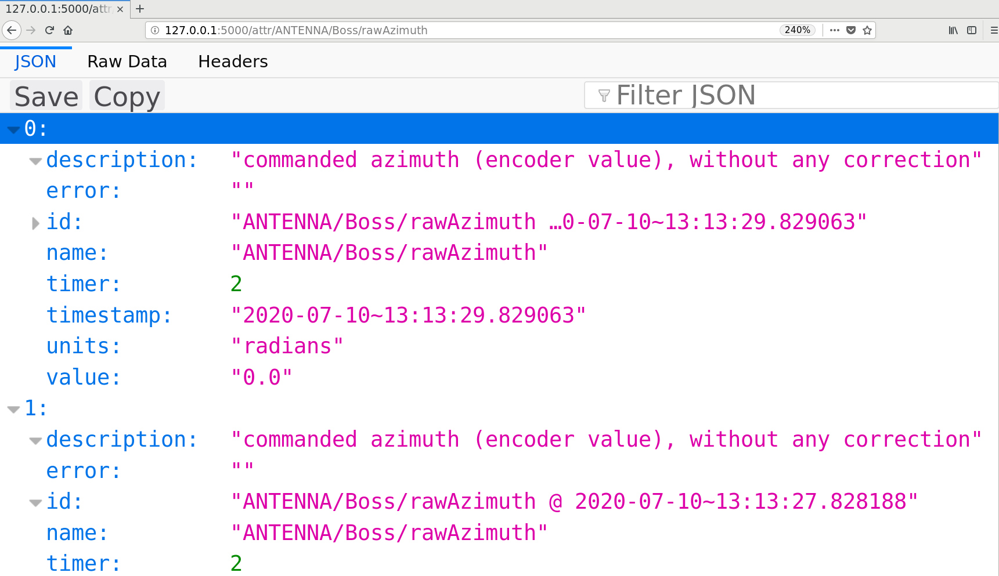

.. _api:

*********************************
Application Programming Interface
*********************************

This chapter explains how to send commands to the control system
and how to get the antenna parameters by means of an HTTP API.
You can build your clients in whatever programming language you
want and make it running on any operating system.

How to get the antenna parameters
=================================
Suricate is configured by means of a configuration file. There are
three templates, one for each telescope, and every template contains all
parameters you can get for that telescope. Have a look at the first 20 lines
of the :download:`SRT configuration file <../templates/srt.yaml>`:

.. literalinclude:: ../templates/srt.yaml
   :language: yaml
   :lines: 1-20
   :linenos:

Basically there is a list of *components*, and every component
has some parameters (*properties* or *methods*) that you can ask for.
They are identified by the lable ``name``, it means, regarding to previous
lines, you can get the following ``ANTENNA/Boss`` parameters: ``rawAzimuth``,
``rawElevation``, ``observedAzimuth``, ``observedElevation``.

For instance, you can get the ``rawAzimuth``
parameter by pointing a browser to
``http://192.168.200.203:5000/attr/ANTENNA/Boss/rawAzimuth``.

.. note:: In this image you see the browser pointing to localhost. That is
   because the control system was running locally, over a simulator.
   The proper IP address, at the Sardinia Radio Telescope, is
   ``192.168.200.203``.

In all likelihood you want to get the parameters programmatically. Let's
see how to do it by using Python:

.. code-block:: python

   >>> target = 'ANTENNA/Boss/rawAzimuth'
   >>> import requests
   >>> r = requests.get('http://192.168.200.203:5000/attr/%s' % target)
   >>> r.json()
   [
     {
       'description': 'commanded azimuth (encoder value),...',
       'timestamp': '2020-07-10~13:28:57.842001',
       'timer': 2.0,
       'value': '1.3248',
       'error': '',
       'units': 'radians',
       'id': 'ANTENNA/Boss/rawAzimuth @ 2020-07-10~13:28:57.842001',
       'name': 'ANTENNA/Boss/rawAzimuth'
     }
     {
       'description': 'commanded azimuth (encoder value),...',
       'timestamp': '2020-07-10~13:28:56.428177',
       'timer': 2.0,
       'value': '1.3492',
       'error': '',
       'units': 'radians',
       'id': 'ANTENNA/Boss/rawAzimuth @ 2020-07-10~13:28:56.428177',
       'name': 'ANTENNA/Boss/rawAzimuth'
     }
    ...
   ]

From now on in this documentation we do not write anymore the base URL
``http://192.168.200.203:5000``.
That is just for the sake of simplicity, you still need to write it in your
code. You can use the following URLs:

* ``/attr/SYSTEM/Component/name``: last ten data dictionaries for the
  attribute ``name``. Each dictionary has eight items (``description``,
  ``timestamp``, ``timer``, ``value``, and so forth). In case
  of failure, the ``error`` field describes the issue and the ``value`` field
  is not reliable.

* ``/attr/SYSTEM/Component/name/N``: last ``N`` data dictionaries for
  attribute ``name``.

* ``/attr/SYSTEM/Component/name/from/x``: all data dictionaries for attribute ``name``,
  starting from timestamp ``x`` until now. The timestamp must have the following format:
  ``YYYY-MM-DD~HH-mm-SS.f``.  For instance, here is an example: ``2020-07-10~13:28:56.428177``

* ``/attr/SYSTEM/Component/name/from/x/to/y``: all data dictionaries for
  attribute ``name``, starting from timestamp ``x`` until timestamp ``y``.

For instance, in previous example we had ``ANTENNA/Boss/rawAzimuth``
for ``SYSTEM/Component/name``. The system was ``ANTENNA``, che component was
``Boss`` and the attribute name was ``rawAzimuth``.

The attributes information is retrieved from a persistent data base. If you want to
build a client that requires real time data, the best way is to use a Redis
client, as explained in chapter :ref:`monitor`.

Summarizing, ``http://192.168.200.203:5000`` as base URL, and:

#. ``/attr/SYSTEM/Component/name``: last 10

#. ``/attr/SYSTEM/Component/name/N``: last N

#. ``/attr/SYSTEM/Component/name/from/x``: from timestamp x

#. ``/attr/SYSTEM/Component/name/from/x/to/y``: from timestamp x to y.

How to execute a command
========================
To execute a command ``foo``, use the following ``POST`` request::

   POST /cmd/foo

For instance, that is the case for ``getTpi`` command:

.. code-block:: python

   >>> import requests
   >>> r = requests.post('http://192.168.200.203:5000/cmd/getTpi')

The response is a json dictionary containing some information
about the command:

.. code-block:: python

   >>> r.json()
   {
     'delivered': True,
     'complete': False,
     'success': False,
     'command': 'getTpi',
     'result': 'unknown',
     'stime': '2020-07-10~14:26:21.442051'
     'etime': '2020-07-10~14:26:21.442051',
     'seconds': 0.0,
     'id': 'getTpi_2020-07-10~14:26:21.442051',
   }

The fields have the following meaning:

* ``command``: the command sent to the system.
* ``stime``: starting execution time.
* ``etime``: ending execution time.
* ``delivered``: has the command been delived to the scheduler?
  In case it is ``False``, maybe the redis queue was not running.
  See :ref:`admin-guide` for more details.
* ``complete``: has the command terminated its execution?
* ``success``: the boolean ``success`` returned by the scheduler.
  In case it is ``False``, the command has not been executed properly.
* ``result``: is the ``answer`` returned by the scheduler.
* ``seconds``: seconds of execution for the command.
* ``id``: the database ``id`` field.

The request is *no blocking*, it means that the server returns immediately
a response and put the request in a queue, to be dispatched as soon as possible.
It also means that the fields of the response tell you only the status
of the execution at time zero. That is not enough:
the following section explains how to know the status of the command.

How to get the command status
=============================
When you execute a command, the response gives you the command ``id``:

.. code-block:: python

   >>> import requests
   >>> r = requests.post('http://192.168.200.203:5000/cmd/getTpi')
   >>> response = r.json()
   >>> response
   {
     'complete': False,
         ...
     'seconds': 0.0,
     'id': 'getTpi_2020-07-10~14:26:21.442051',
   }

Use this ``id`` to ask for the status of the command.
You have to perform a GET request instead of a POST one:

.. code-block:: python

   >>> id = response['id']
   >>> r = requests.get('http://192.168.200.203:5000/cmd/%s' % id)
   >>> r.json()
   {
     'delivered': True,
     'complete': False,
     'success': False,
     'command': 'getTpi',
     'result': 'unknown'
     'stime': '2020-07-10~14:26:21.442051'
     'etime': '2020-07-10~14:26:21.442051'
     'seconds': 0.0
     'id': 'getTpi_2020-07-10~14:26:21.442051',
   }
   >>> r = requests.get('http://192.168.200.203:5000/cmd/%s' % id)
   >>> r.json()
   {
     'delivered': True,
     'complete': True,
     'success': True,
     'command': 'getTpi',
     'result': 'getTpi\\\n00) 2508.475000\n01) 2506.97500'
     'stime': '2020-07-10~14:26:21.442051'
     'etime': '2020-07-10~14:26:21.831193',
     'seconds': 0.389142,
     'id': 'getTpi_2020-07-10~14:26:21.442051',
   }
