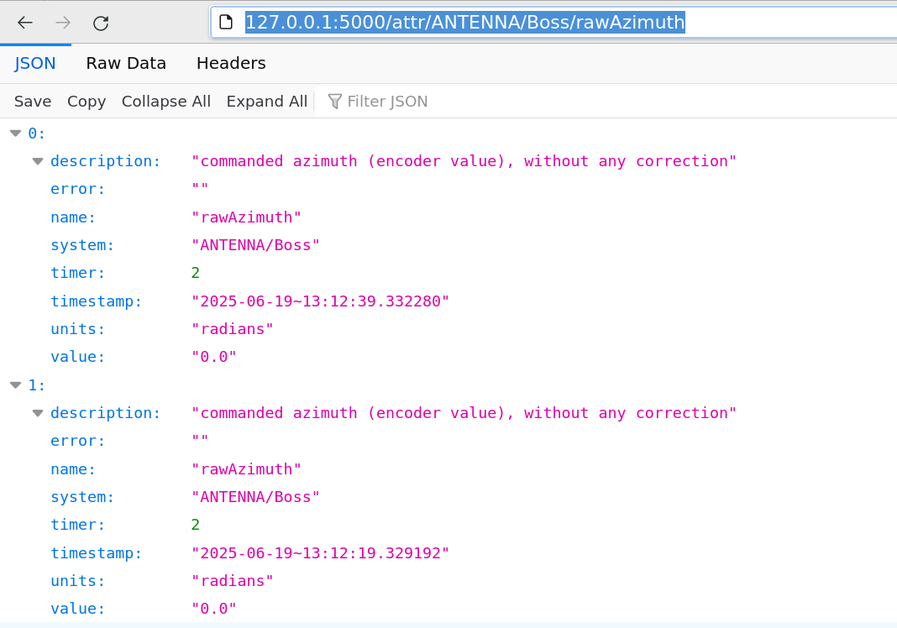

.. _quickstart:

**********
Quickstart
**********

Now that Suricate has been successfully installed, this chapter provides a quick overview of how to use it. The goal is to help you get started with the essential features as quickly as possible.

In this section, you'll see how to retrieve antenna parameters using Python. However, as explained in the following, more comprehensive chapters, the same operations can be performed using any programming language and operating system.

Start the virtual machine, then login::

   $ ssh -X discos@192.168.56.200

Suricate is active from the boot, ACS is not running.

Redis
=====
In the terminal where you logged in, open ``ipython`` and ask for
the antenna azimuth via Redis. You should get a message informing
that ACS is not running:

.. code-block:: python

   >>> import redis  # Press CTR-C and ENTER key if it's blocked
   >>> r = redis.StrictRedis()
   >>> r.hgetall('ANTENNA/Mount/azimuth')
   {
    b'error': b'ACS not running', b'value': b'', b'timer': b'2.0',
    b'units': b'deg    ree', b'description': b'azimuth (encoder value),
    without any correction', b'timestamp': b'2025-06-17~15:59:03.394297'
   }

Start DISCOS simulator and DISCOS::

   $ discos-simulator start
   $ discosup

Wait until DISCOS is ready, now you should get the proper azimuth value:

.. code-block:: python

   >>> r.hgetall('ANTENNA/Mount/azimuth')
   {
    b'error': b'', b'value': b'180.0', b'timer': b'2.0', b'units':
    b'degree', b'description': b'azimuth (encoder value), without
    any correction', b'timestamp': b'2025-06-17~16:00:59.905952'
   }

HTTP request library
====================
In the terminal where you logged in, open ``ipython`` and
ask for the antenna azimuth via HTTP GET, using the Python
``requests`` library. You will get a list containing the
last values:

.. code-block:: python

   >>> url = 'http://127.0.0.1:5000/attr/ANTENNA/Mount/azimuth'
   >>> import requests
   >>> r = requests.get(url)
   >>> r.json()
   [
     {
      'description': 'azimuth (encoder value), without any correction',
      'error': '', 'name': 'azimuth', 'system': 'ANTENNA/Mount',
      'timer': 2.0, 'timestamp': '2025-06-19~13:01:55.332091',
      'units': 'degree', 'value': '180.0'
     },
     {
      'description': 'azimuth (encoder value), without any correction',
      'error': '', 'name': 'azimuth', 'system': 'ANTENNA/Mount',
      'timer': 2.0, 'timestamp': '2025-06-19~13:01:35.333493',
      'units': 'degree', 'value': '180.0'
     },
         ...
   ]

You can also get the parameters through a browser. From the same terminal,
run ``firefox``::

   $ firefox

Access the URL you used earlier with the ``requests`` library:

Final notes
===========
In all these examples, you got the antenna parameters from inside
the virtual machine. If you want to access from outside, use the
IP address ``192.168.56.200``. That's an example with Redis, that
you can execute only if the Python ``redis`` library is installed
in your machine:

.. code-block:: python

   >>> import redis
   >>> r = redis.StrictRedis(host='192.168.56.200')
   >>> r.hgetall('ANTENNA/Mount/azimuth')
   {
     b'error': b'', b'value': b'180.0', b'timer': b'2.0',
     b'units': b'degree', b'description': b'azimuth (encoder value),
     without any correction', b'timestamp': b'2025-06-19~13:25:45.331571'
   }
